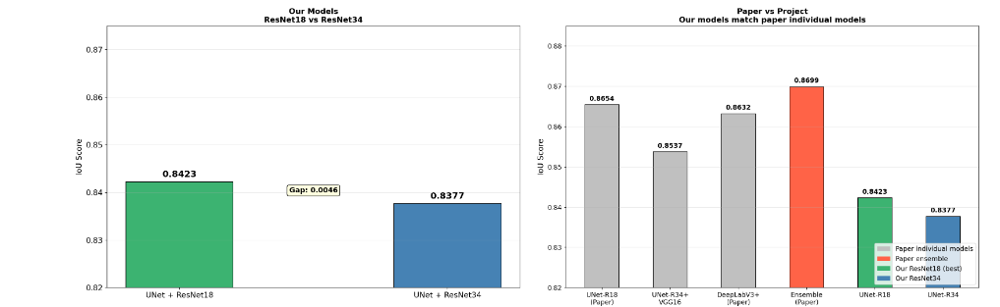
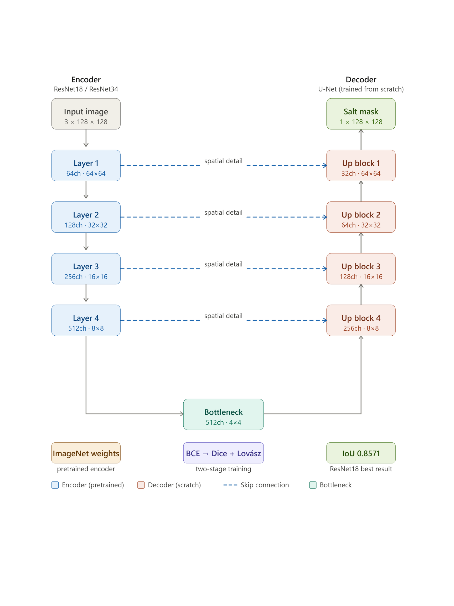

# TGS Salt Segmentation — U-Net with ResNet18 & ResNet34


---

## What This Project Does

Seismic exploration companies drill into the earth looking for oil and gas. One of the biggest challenges is identifying underground salt deposits salt changes the seismic signal in ways that make it hard to locate hydrocarbons below it. This project builds a deep learning model that looks at a seismic image and highlights every pixel belonging to a salt deposit.

This is the same dataset and domain from my published research. I rebuilt the pipeline here as individual model baselines to:

- Validate that the two-stage BCE → Dice + Lovász training strategy works consistently
- Run a controlled comparison between ResNet18 and ResNet34 as U-Net encoders
- Understand the variance across multiple training runs before drawing conclusions

---

## Results

### Best Results

| Model | Encoder | Loss Strategy | IoU |
|-------|---------|--------------|-----|
| U-Net (this project) | ResNet18 | BCE → Dice + Lovász | **0.8571** |
| U-Net (this project) | ResNet34 | BCE → Dice + Lovász | 0.8453 |
| Ensemble (published paper) | ResNet18 + ResNet34 + VGG16 + InceptionV3 + DeepLabV3+ | BCE → Dice + Lovász | **0.8699** |

### Reproducibility — 3 Independent Runs

I ran the experiment 3 times to check whether results were consistent or just lucky initialization:

| Run | ResNet18 | ResNet34 | Winner |
|-----|----------|----------|--------|
| Run 1 | **0.8571** | 0.8453 | ResNet18 |
| Run 2 | 0.8440 | **0.8503** | ResNet34 |
| Run 3 | 0.8423 | 0.8377 | ResNet18 |
| **Average** | **0.8478** | 0.8444 | **ResNet18** |

ResNet18 wins 2 out of 3 runs and has a higher average IoU. The gap between runs (0.005–0.012) is normal training variance from random weight initialization and data shuffling. Running multiple times is the only reliable way to confirm whether an architecture difference is real or coincidence.

### Key Finding

**ResNet18 consistently outperforms ResNet34 on TGS 101×101 pixel images.**

The reason is image size. TGS images are only 101×101 pixels — much smaller than the 224×224 images both ResNets were designed for. ResNet34's deeper architecture compresses spatial information more aggressively, losing boundary detail that is critical for precise segmentation. ResNet18's lighter design preserves more spatial information at this resolution. This is consistent with findings in the medical imaging segmentation literature where lighter encoders outperform deeper ones on small pathology images.

My published paper used both architectures in the ensemble precisely to capture the strengths of each.

---

## Prediction Results





---

## How the Model Works


The encoder learns *what* is in the image. The decoder learns *where* it is. Skip connections pass spatial detail from each encoder level directly to the matching decoder level — this is what allows precise boundary prediction.

**Encoder:** ResNet18 or ResNet34, pretrained on ImageNet (transfer learning)  
**Decoder:** U-Net with skip connections  
**Output:** Single channel binary mask — salt pixel = 1, no salt = 0

---

## Two-Stage Training Strategy

This mirrors the exact approach from my published paper:

| Stage | Epochs | Loss | Why |
|-------|--------|------|-----|
| Stage 1 | 1 – 50 | Binary Cross Entropy (BCE) | Stable gradients from the start — works even with random early predictions |
| Stage 2 | 51 – 60 | Dice + Lovász | Directly maximize IoU — optimizes the exact metric we measure |

**Why not just use IoU as the loss from the start?**  
IoU is not differentiable — it counts discrete pixels, which creates a step function with zero gradient. Lovász Loss is a smooth mathematical approximation of IoU that has valid gradients everywhere. But Lovász gradients are unstable when predictions are random. BCE first brings the model to a stable baseline, then Lovász fine-tunes it precisely toward higher IoU.

The jump in loss at epoch 51 in the training curves is expected — the scale of Dice + Lovász is different from BCE. The IoU continues improving despite this.

---

## Augmentations

All augmentations are applied using Albumentations, which applies the **identical transform to both image and mask simultaneously** — if the image is flipped horizontally, the salt mask flips too.

| Augmentation | Probability | Why |
|---|---|---|
| HorizontalFlip | 50% | Salt deposits appear on any side of the image |
| VerticalFlip | 30% | Adds orientation diversity |
| RandomBrightnessContrast | 40% | Different seismic equipment produces different scan intensities |
| ShiftScaleRotate | 50% | Sensor positioning variation during field surveys |
| GaussNoise or GaussianBlur | 30% | Seismic equipment sensor noise |
| Normalize (ImageNet stats) | Always | Required for pretrained ResNet weights to work correctly |

Augmentations are only applied to the training set. Validation always uses original unmodified images so metrics reflect true performance.

---

## Dataset

| Split | Images |
|-------|--------|
| Training | 3,400 |
| Validation | 600 |
| **Total** | **4,000** |

- Original image size: 101 × 101 pixels (resized to 128 × 128 for training)
- Salt coverage: 61% of images contain salt, 39% are empty
- Task: Binary segmentation — each pixel is either salt (1) or background (0)
- Evaluation: IoU (Intersection over Union)

The 61/39 split is much better balanced than the Severstal steel dataset where some defect classes appeared in under 3% of images. Standard BCE loss handles this balance without needing special imbalance techniques.

---

## Hyperparameters

| Setting | Value | Reasoning |
|---------|-------|-----------|
| Image size | 128 × 128 | Larger than 101×101 original. Power of 2 works efficiently with CNNs |
| Batch size | 32 | Fits T4 GPU memory. Tried 64 — ran out of memory |
| Epochs | 60 | Stage 1: 50 epochs BCE. Stage 2: 10 epochs Dice+Lovász |
| Learning rate | 1e-3 | Tried 1e-4 — converged too slowly |
| Optimizer | AdamW | Adaptive learning rate per parameter + correct weight decay |
| Scheduler | CosineAnnealingLR | Smooth LR decay from 1e-3 to 1e-6 over 60 epochs |
| Threshold | 0.5 | Sigmoid output > 0.5 = predicted as salt |
| Precision | Mixed float16 | ~2x faster training on T4 GPU |

---

## Connection to Published Research

> **Semantic Segmentation and Augmentation of salt in seismic images using Deep Learning**  
> Ch.Sai Harsha et al. — IJFANS International Journal, Vol 11, Iss 12, Dec 2022  
> DOI: [10.48047/IJFANS/V11/I12/215](https://doi.org/10.48047/IJFANS/V11/I12/215)

The paper built an ensemble of 5 architectures on the same dataset:

| Paper Model | Individual IoU |
|-------------|---------------|
| UNet-ResNet18 | 0.8654 |
| UNet-ResNet34 + VGG16 + InceptionV3 | 0.8537 |
| DeepLabV3+ | 0.8632 |
| **Ensemble** | **0.8699** |

This project's single model baselines (best: 0.8571 with ResNet18) are competitive with the paper's individual models. The gap of 0.013 from the ensemble is expected — combining multiple architectures always outperforms any single one. The ensemble approach is documented in the paper.

---

## How to Run

### Kaggle — Free T4 GPU (Recommended)

1. Go to [kaggle.com](https://kaggle.com) and sign in
2. Create a new notebook
3. **Add Input** → Competitions → **TGS Salt Identification Challenge**
4. **Session options** → Accelerator → **GPU T4 x2**
5. Upload and run `Salt_Segmentation.ipynb`
6. Total runtime: approximately 3 hours on T4 GPU

### Requirements

```
segmentation-models-pytorch
albumentations
torch
opencv-python
pandas
numpy
matplotlib
scikit-learn
tqdm
```

---

## Files

```
tgs-salt-segmentation/
├── Salt_Segmentation.ipynb      ← Full notebook with all cells and outputs
├── README.md                    ← This file
├── output.png                   ← ResNet34 prediction samples
└── predictions_resnet18.png     ← ResNet18 prediction samples
```

---

*Built as part of an applied computer vision portfolio focused on geoscientific subsurface imaging — the same domain as geotechnical AI applications.*
