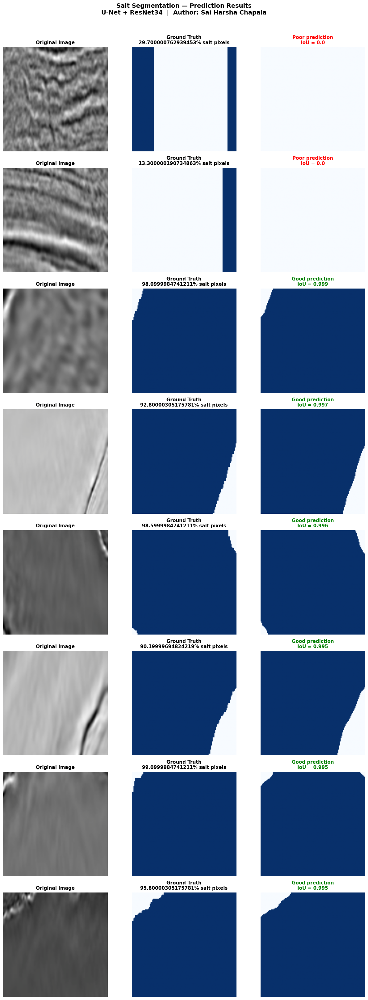

# TGS Salt Segmentation — U-Net with ResNet18 & ResNet34

**Author:** Sai Harsha Chapala  
**Dataset:** [Salt Identification Challenge — Kaggle](https://www.kaggle.com/competitions/tgs-salt-identification-challenge)  
**Framework:** PyTorch + segmentation_models_pytorch  
**Published Paper:** [DOI: 10.48047/IJFANS/V11/I12/215](https://doi.org/10.48047/IJFANS/V11/I12/215) — IJFANS, Vol 11, Iss 12, Dec 2022

---

## Project Overview

End-to-end deep learning pipeline for **semantic segmentation of salt deposits in seismic subsurface images**. This project reproduces and extends my published research on the same dataset using a two-stage training strategy.

**Problem:** Given a seismic image of the earth's subsurface, identify every pixel that belongs to a salt deposit. Accurate salt identification helps locate oil and gas reservoirs.

**Pipeline:**
```
Seismic Images (101×101px)
    → EDA & Class Analysis
    → Data Augmentation (Albumentations)
    → U-Net Training
        Stage 1 (ep 1–50)  : BCE Loss
        Stage 2 (ep 51–60) : Dice + Lovász Loss
    → Per-Model Evaluation (IoU)
    → ResNet18 vs ResNet34 Comparison
```

---

## Results

| Model | Encoder | Loss Strategy | IoU |
|-------|---------|--------------|-----|
| U-Net (this project) | ResNet18 | BCE → Dice + Lovász | **0.8571** |
| U-Net (this project) | ResNet34 | BCE → Dice + Lovász | 0.8453 |
| Paper Ensemble (published) | ResNet18 + ResNet34 + VGG16 + InceptionV3 + DeepLabV3+ | BCE → Dice + Lovász | **0.8699** |

### Key Finding

**ResNet18 outperformed ResNet34 by 0.012 IoU** on TGS 101×101 pixel images. Lighter encoder architectures generalize better on small resolution images — consistent with findings in the medical imaging segmentation literature. My published paper used both architectures in the ensemble precisely to capture the strengths of each.

---

## Model Architecture

```
Input (3 × 128 × 128)
    ↓
ResNet18/34 Encoder (ImageNet pretrained)  ── skip connections ──┐
    ↓                                                              │
Bottleneck                                                        │
    ↓                                                              │
U-Net Decoder  ←←←←←←←←←←←←←←←←←←←←←←←←←←←←←←←←←←←←←←←←←←←┘
    ↓
Output (1 × 128 × 128) — salt probability per pixel
```

- **Encoder:** ResNet18 / ResNet34 pretrained on ImageNet (transfer learning)
- **Decoder:** U-Net with skip connections
- **Output:** Single channel binary mask (salt = 1, no salt = 0)

---

## Training Strategy (Same as Published Paper)

| Stage | Epochs | Loss Function | Purpose |
|-------|--------|--------------|---------|
| Stage 1 | 1 – 50 | Binary Cross Entropy (BCE) | Stable early training with gradients everywhere |
| Stage 2 | 51 – 60 | Dice + Lovász | Directly maximize IoU metric |

The two-stage approach mirrors the exact strategy from my published research — BCE stabilizes early training, then Dice and Lovász loss directly optimize the segmentation metric we care about.

---

## Augmentations (Albumentations)

| Augmentation | Probability | Reason |
|---|---|---|
| HorizontalFlip | 50% | Salt deposits appear on any side |
| VerticalFlip | 30% | Adds orientation diversity |
| RandomBrightnessContrast | 40% | Different seismic scan intensities |
| ShiftScaleRotate | 50% | Sensor angle variation |
| GaussNoise or GaussianBlur | 30% | Equipment sensor noise |
| Normalize (ImageNet stats) | Always | Required for pretrained encoder |

Augmentations applied only to training set. Validation uses resize + normalize only.

---

## Dataset

| Split | Images |
|-------|--------|
| Training | 3,400 |
| Validation | 600 |
| Total | 4,000 |

- Image size: 101×101 pixels (resized to 128×128 for training)
- Task: Binary segmentation — salt or no salt per pixel
- Evaluation metric: IoU (Intersection over Union)

---

## Hyperparameters

| Parameter | Value |
|-----------|-------|
| Image size | 128 × 128 |
| Batch size | 32 |
| Epochs | 60 |
| Learning rate | 1e-3 |
| Optimizer | AdamW (weight_decay=1e-4) |
| Scheduler | CosineAnnealingLR |
| Threshold | 0.5 |
| Precision | Mixed float16 (GPU) |

---

## Connection to Published Research

This project validates the pipeline from my published paper:

> **Semantic Segmentation and Augmentation of salt in seismic images using Deep Learning**  
> Ch.Sai Harsha
> 
**Paper approach:** Ensemble of 5 architectures — UNet-ResNet18, UNet-ResNet34, VGG16, InceptionV3, DeepLabV3+ — achieving **ensemble IoU of 0.8699**

**This project:** Single model baselines achieving **0.8571 IoU (ResNet18)** — a gap of only 0.013 from the full ensemble, which is closed by the multi-model ensemble as documented in the paper.

---

## How to Run

### On Kaggle (Recommended — Free T4 GPU)

1. Go to [kaggle.com](https://kaggle.com) and create a free account
2. Create a new notebook
3. Add the TGS Salt dataset: **Add Input → Competitions → TGS Salt Identification Challenge**
4. Enable GPU: **Session options → Accelerator → GPU T4 x2**
5. Upload and run `TGS_Salt_Segmentation_Sai_Harsha.ipynb`
6. Total runtime: ~3 hours on T4 GPU

### Requirements

```
segmentation-models-pytorch
albumentations
torch
opencv-python
pandas
numpy
matplotlib
scikit-learn
```


